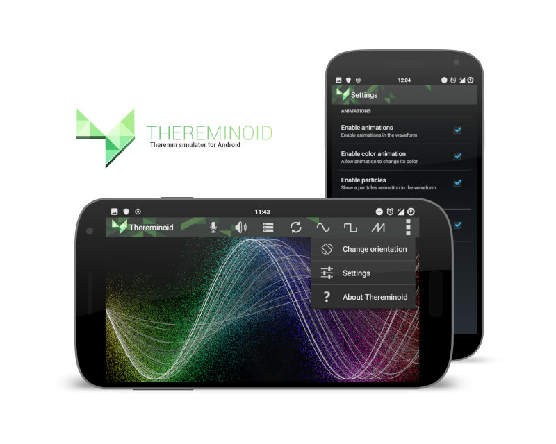

# Thereminoid
Theremin simulator for Android that supports magnetic and proximity sensors.

## Features
- Three signals available (sinus, square and saw).
- Colorful animated signals.
- Use a magnet to change the signal frequency.
- Use the proximity or luminosity sensor to change the volume.

## Bugs
- Sound is aliased.
- A crash can occur when the device is being rotated or in standby mode.
- Record mode is not working yet.

## Authors
Cyriaque 'cisoun' Skrapits  ([Github](https://github.com/cisoun))  
Eddy 'beerf' Strambini ([Github](https://github.com/Edstr))
